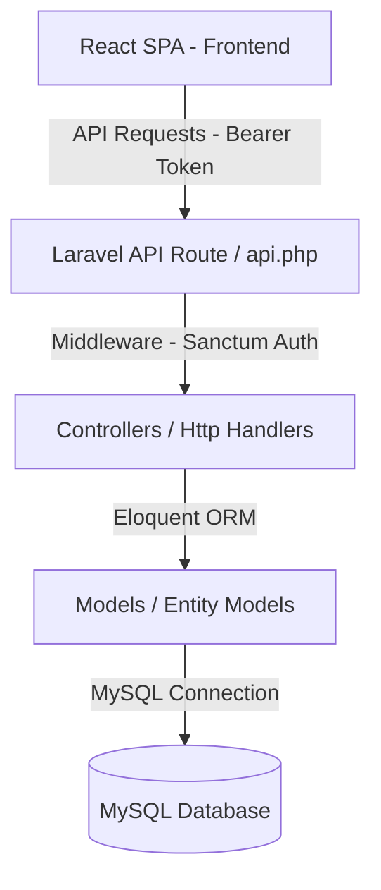
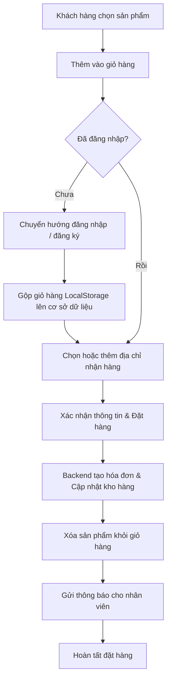
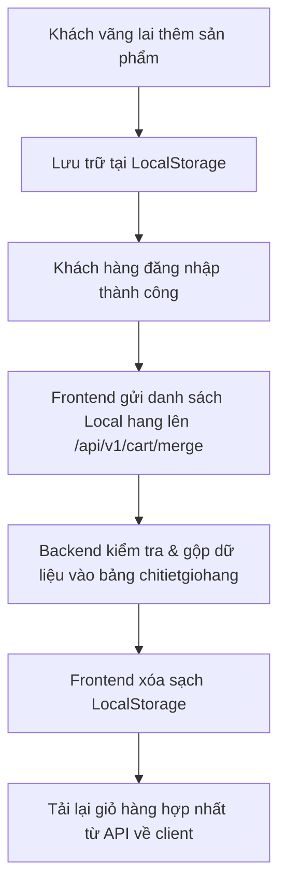
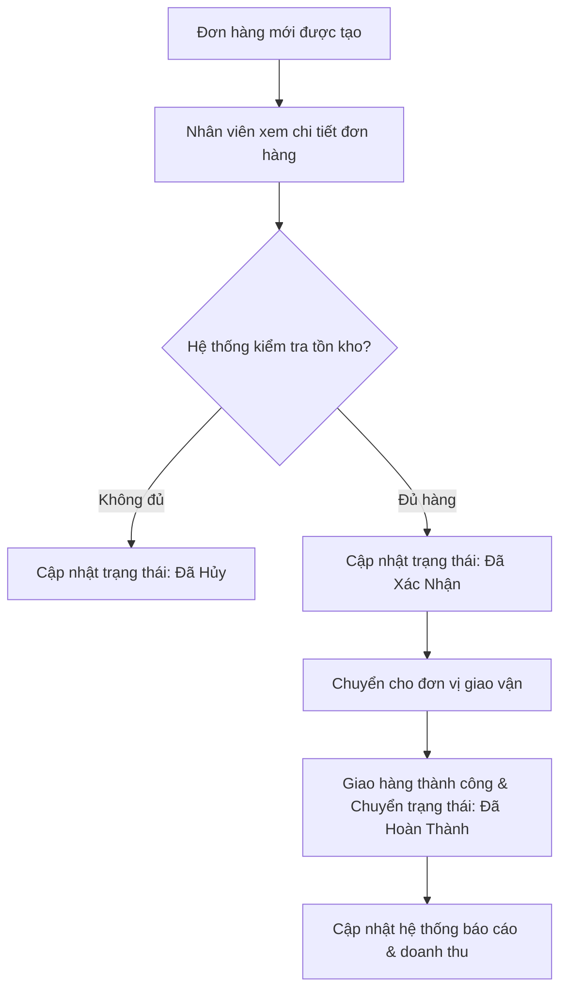

# BookZone - Hệ thống Quản lý và Bán sách Trực tuyến

Hệ thống bán sách và văn phòng phẩm BookZone được thiết kế theo kiến trúc hiện đại, tách biệt hoàn toàn giữa Backend (Laravel RESTful API) và Frontend (React Single Page Application). Dự án giải quyết nhu cầu mua sắm trực tuyến của khách hàng đồng thời cung cấp công cụ quản trị tinh gọn cho phân hệ quản lý nội bộ (nhân viên và người quản trị).

## Kiến trúc Hệ thống

Hệ thống áp dụng kiến trúc phân tầng rời rạc (Decoupled Architecture):

- Backend: Laravel 12 đóng vai trò là API Server cung cấp RESTful API, sử dụng Laravel Sanctum để xác thực người dùng thông qua cơ chế Bearer Token (API Tokens).
- Frontend: Single Page Application (SPA) xây dựng trên nền tảng React và build tool Vite, sử dụng Tailwind CSS làm framework giao diện và Axios để giao tiếp bất đồng bộ với API.
- Cơ sở dữ liệu: Hệ quản trị cơ sở dữ liệu MySQL gồm 17 bảng logic biểu diễn các thực thể sản phẩm (sách, văn phòng phẩm), đơn hàng, khách hàng, nhân viên và các chương trình khuyến mãi.



---

## Quy trình Hoạt động Chính

### 1. Quy trình Mua hàng và Thanh toán của Khách hàng

Quy trình từ lúc khách hàng lựa chọn sản phẩm cho đến khi đặt hàng thành công:



### 2. Quy trình Đồng bộ Giỏ hàng (Guest Cart to Customer Cart)

Hỗ trợ người dùng chưa đăng nhập tích lũy sản phẩm vào giỏ hàng tạm thời và tự động đồng bộ ngay sau khi đăng nhập thành công:



### 3. Quy trình Xử lý Đơn hàng của Nhân viên (Employee Order Flow)

Nhân viên nội bộ tiếp nhận và xử lý các đơn hàng đặt từ phân hệ khách hàng hoặc trực tiếp thiết lập đơn bán tại quầy:



---

## Phân hệ và Các Chức năng Chi tiết

### 1. Phân hệ Khách hàng (Customer Portal)

Giúp khách hàng tiếp cận sản phẩm, theo dõi giỏ hàng và thực hiện giao dịch:

- Tìm kiếm và Bộ lọc: Hỗ trợ tìm kiếm theo từ khóa, phân loại chi tiết theo danh mục, nhà xuất bản, nhà cung cấp, tác giả, loại sách, đơn vị tính, khoảng giá và các sản phẩm đang áp dụng khuyến mãi.
- Giỏ hàng thông minh: Lưu trữ trạng thái giỏ hàng phía client qua LocalStorage nếu chưa đăng nhập, và tự động gộp vào cơ sở dữ liệu thông qua endpoint `/cart/merge` sau khi đăng nhập.
- Sổ địa chỉ: Cho phép khách hàng quản lý nhiều địa chỉ giao hàng khác nhau để sử dụng linh hoạt khi thanh toán.
- Đặt hàng và lịch sử giao dịch: Hiển thị danh sách đơn hàng, chi tiết các sản phẩm đã đặt và trạng thái vận chuyển thời gian thực.
- Danh sách yêu thích: Lưu trữ các sản phẩm người dùng quan tâm để truy cập nhanh.
- Đánh giá sản phẩm: Cho phép người dùng đã mua hàng đánh giá sao và viết bình luận phản hồi về sản phẩm.
- Hệ thống thông báo: Nhận tin nhắn về thay đổi trạng thái đơn hàng hoặc các chương trình khuyến mãi mới.

### 2. Phân hệ Nhân viên (Employee/Admin Portal)

Công cụ nội bộ phục vụ công tác quản trị vận hành và theo dõi hiệu suất kinh doanh:

- Dashboard: Biểu diễn các số liệu tổng quan về doanh thu, số đơn hàng, số khách hàng mới và biểu đồ báo cáo hiệu suất bán hàng.
- Quản lý danh mục & sản phẩm (CRUD):
  - Sản phẩm tổng quát (Sản phẩm chung).
  - Sách (Đi kèm trường thông tin NXB, năm xuất bản, tác giả, loại sách).
  - Văn phòng phẩm (Mô tả, xuất xứ, đơn vị tính).
  - Cho phép upload hình ảnh trực tiếp lên server thông qua hệ thống storage.
- Quản lý thông tin nghiệp vụ: Quản lý thông tin về Nhà xuất bản, Nhà cung cấp, Tác giả, Đơn vị tính và Các loại sách.
- Quản lý khách hàng & nhân viên: Xem lịch sử khách hàng và phân quyền truy cập, quản lý danh sách tài khoản nhân viên hoạt động.
- Chương trình Khuyến mãi (CRUD): Định nghĩa các chương trình giảm giá thời hạn cụ thể, ghép danh sách sản phẩm được áp dụng chiết khấu với mức tỷ lệ giảm giá tương ứng.
- Quản lý đơn hàng: Nhân viên có thể tự tạo đơn hàng mới (bán offline tại cửa hàng) hoặc cập nhật tình trạng đơn hàng online của khách hàng.
- Báo cáo thống kê: Xuất dữ liệu thống kê doanh thu theo ngày/tháng/nam và hiệu suất bán hàng của từng dòng sản phẩm.

---

## Cơ sở Dữ liệu và Thiết kế Thực thể

Cơ sở dữ liệu được tổ chức trên MySQL với 17 bảng nghiệp vụ được quản lý qua Laravel Eloquent Models. Thiết kế thực thể nổi bật bởi việc áp dụng mô hình kế thừa bảng một-nhiều hoặc một-một giữa Sản phẩm tổng quát và các loại sản phẩm đặc thù:

- Bảng `sanpham` lưu trữ thông tin chung: ID, tên sản phẩm, hình ảnh, giá bán, số lượng tồn kho, mô tả.
- Bảng `sach` lưu trữ các thuộc tính đặc thù của sách: ID nhà xuất bản, tác gia, năm xuất bản, loại sách. Bảng này liên kết 1-1 với bảng `sanpham` thông qua trường `sanpham_id`.
- Bảng `vanphongpham` lưu trữ các thông tin riêng của thiết bị, đồ dùng văn phòng: Xuất xứ, chất liệu, phân hạng sản phẩm.

### Danh sách các bảng chi tiết

- `sanpham`: Thông tin chung của sản phẩm.
- `sach`: Thuộc tính đặc thù riêng của sách.
- `vanphongpham`: Thuộc tính đặc thù riêng của thiết bị văn phòng phẩm.
- `danhmucsanpham`: Các phân nhóm sản phẩm (sách kiểu học tập, tiểu thuyết, văn phòng phẩm học sinh...).
- `loaisach`: Các mã loại sách (thể loại văn học, khoa học, ngôn tình...).
- `tacgia`: Thông tin nhà văn, tác giả sản phẩm.
- `nhaxuatban`: Các đơn vị in ấn và phân phối sách.
- `nhacungcap`: Các nhà phân phối sản phẩm vào hệ thống.
- `donvitinh`: Thông tin đơn vị tính (Cuốn, chiếc, hộp, bộ).
- `khachhang`: Tài khoản truy cập của khách hàng.
- `nhanvien`: Tài khoản nội bộ của nhân viên (quản lý hoặc nhân viên bán hàng).
- `giohang` & `chitietgiohang`: Lưu trữ danh sách các item khách hàng dự định mua trên hệ thống database.
- `hoadon` & `chitiethoadon`: Thông tin ghi nhận doanh thu, lịch sử mua hàng.
- `khuyenmai` & `chitietkhuyenmai`: Thiết lập giảm giá sản phẩm trong khoảng thời gian nhất định.
- `danhgia`: Lưu trữ phản hồi và điểm số sao của khách hàng đối với sản phẩm đã mua.
- `sanphamyeuthich`: Danh sách sản phẩm quan tâm của khách hàng.
- `diachi_giaohang`: Danh sách địa chỉ nhận hàng của khách hàng.
- `thongbao`: Lưu thông tin hệ thống gửi cho người dùng.

---

## Hướng dẫn Cài đặt và Vận hành

### Yêu cầu hệ thống

- PHP từ version 8.2 trở lên.
- Node.js từ version 18 trở lên cùng với npm.
- MySQL server từ version 8.0 trở lên.
- Composer phiên bản mới nhất.

### 1. Cài đặt Backend (Laravel API)

Chuyển hướng vào thư mục `backend/` và thực hiện các lệnh sau:

```bash
cd backend
composer install
cp .env.example .env
php artisan key:generate
```

Cấu hình cơ sở dữ liệu trong file `.env` vừa tạo:

```env
DB_CONNECTION=mysql
DB_HOST=127.0.0.1
DB_PORT=3306
DB_DATABASE=db_nhasach
DB_USERNAME=root
DB_PASSWORD=your_mysql_password
```

Chạy migration và nạp cơ sở dữ liệu mẫu:
Nếu bạn đã có file database dump từ trước (`template_database/db_nhasach.sql`), hãy import file này trực tiếp vào database MySQL của bạn trước khi khởi động dự án.

Khởi động backend server:

```bash
php artisan serve
```

Server sẽ chạy tại địa chỉ `http://127.0.0.1:8000`.

### 2. Cài đặt Frontend (React SPA)

Chuyển hướng vào thư mục `frontend/` và thực hiện các bước sau:

```bash
cd frontend
npm install
cp .env.example .env
```

Cấu hình địa chỉ endpoint API backend trong file `.env` của frontend:

```env
VITE_API_URL=http://127.0.0.1:8000/api/v1
```

Khởi động frontend server ở chế độ phát triển (development):

```bash
npm run dev
```

Trình duyệt sẽ khởi chạy tại địa chỉ `http://localhost:5173`. Người dùng có thể truy cập và trải nghiệm hệ thống tại đây.

---

## Cấu trúc Thư mục Chính của Dự án

Hệ thống được tổ chức rõ ràng trong 2 khoảng backend và frontend riêng biệt:

```
bookstore_customer_laravel/
├── backend/                  # Laravel 12 API Application
│   ├── app/
│   │   ├── Http/
│   │   │   ├── Controllers/  # Controllers xử lý logic và trả về JSON response
│   │   │   └── Middleware/   # Các bộ lọc yêu cầu truy cập (auth, role...)
│   │   └── Models/           # Models thiết lập quan hệ thực thể Eloquent
│   ├── config/               # Các file thiết lập hệ thống
│   ├── database/             # Migrations, factories và seeders
│   ├── routes/
│   │   └── api.php           # Định nghĩa toàn bộ endpoint RESTful API v1
│   └── .env.example          # File định hướng cấu hình backend
│
├── frontend/                 # React SPA Application
│   ├── src/
│   │   ├── api/              # Axios client và cấu hình interceptor token
│   │   ├── components/       # Layouts (Customer, Employee) và UI Shared
│   │   ├── contexts/         # Authentication, Cart và Toast Contexts
│   │   ├── modules/          # Customer và Internal routing/modules
│   │   ├── pages/            # View Pages (Home, Detail, Cart, Dashboard...)
│   │   ├── App.jsx           # File cấu hình Router chính
│   │   └── main.jsx          # Điểm khởi chạy của ứng dụng React
│   ├── package.json          # Dependency và các lệnh chạy frontend
│   └── vite.config.js        # File thiết lập compiler và alias Vite
│
└── template_database/        # Chứa script db_nhasach.sql import ban đầu
```
