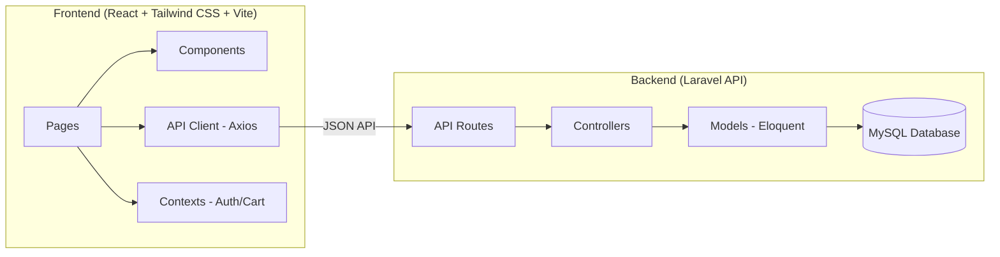

# Kế hoạch Migration: Bookstore → Laravel + React + Tailwind CSS

## Tổng quan kiến trúc

> [!IMPORTANT]
> Project hiện tại đã có sẵn nền tảng tốt. Bên dưới phân tích chi tiết **những gì đã có** và **những gì cần thêm/sửa** để hoàn chỉnh theo project backup cũ.

---

## Đánh giá hiện trạng

### ✅ Đã có và hoạt động

| Phần | Backend (Laravel) | Frontend (React) |
|---|---|---|
| **Auth KH** (login/register/forgot/Google) | ✅ Đầy đủ | ✅ Login, Register |
| **Sản phẩm** (list/detail/filter/sort) | ✅ Đầy đủ | ✅ Products, ProductDetail |
| **Giỏ hàng** (CRUD + guest cart) | ✅ Đầy đủ | ✅ Cart |
| **Đơn hàng KH** (checkout/list/detail) | ✅ Đầy đủ | ✅ Checkout, Orders |
| **Wishlist** (toggle/list) | ✅ Đầy đủ | ✅ Wishlist |
| **Reviews** (submit) | ✅ Đầy đủ | ✅ Trong ProductDetail |
| **Thông báo** (list/toggle/archive) | ✅ Đầy đủ | ✅ Notifications |
| **Account** (profile/password/addresses) | ✅ Đầy đủ | ✅ Account |
| **Trang chủ** | ✅ API products | ✅ Home (banners + sections) |
| **Auth NV** (login/logout) | ✅ Đầy đủ | ✅ EmployeeLogin |
| **NV - Dashboard** (stats cơ bản) | ⚠️ Cơ bản | ✅ Dashboard (đơn giản) |
| **NV - Đơn hàng** (list + update status) | ✅ Đầy đủ | ✅ EmployeeOrders |
| **NV - Products** (list only) | ⚠️ Chỉ list | ✅ EmployeeProducts |
| **NV - Customers** (list only) | ⚠️ Chỉ list | ✅ EmployeeCustomers |
| **NV - Publishers** (list only) | ⚠️ Chỉ list | ✅ EmployeePublishers |
| **NV - Providers** (list only) | ⚠️ Chỉ list | ✅ EmployeeProviders |
| **NV - Categories** (list only) | ⚠️ Chỉ list | ✅ EmployeeCategories |
| **NV - Reports** (doanh thu theo tháng) | ⚠️ Cơ bản | ✅ EmployeeReports |
| **Policies** (about/contact/...) | ✅ Route có | ✅ Có pages |

### ❌ Thiếu - Cần thêm (theo backup cũ)

| Chức năng | Backend | Frontend | Ưu tiên |
|---|---|---|---|
| **CRUD Sản phẩm** (thêm/sửa/xóa + upload ảnh) | ❌ Chưa có API | ⚠️ UI có form nhưng chưa kết nối | 🔴 Cao |
| **CRUD NXB** (thêm/sửa/xóa) | ❌ Chưa có API | ⚠️ UI có form nhưng chưa kết nối | 🔴 Cao |
| **CRUD NCC** (thêm/sửa/xóa) | ❌ Chưa có API | ⚠️ UI có form nhưng chưa kết nối | 🔴 Cao |
| **CRUD Danh mục** (thêm/sửa/xóa) | ❌ Chưa có API | ⚠️ UI có form nhưng chưa kết nối | 🔴 Cao |
| **CRUD NV** (thêm/sửa/xóa) | ❌ Chưa có API | ⚠️ UI có form nhưng chưa kết nối | 🔴 Cao |
| **CRUD Khuyến mãi** (thêm/sửa/xóa + chi tiết) | ❌ Chưa có API | ❌ Chưa có page | 🟡 Trung bình |
| **Dashboard nâng cao** (period stats, charts, low stock) | ❌ Chưa đầy đủ | ⚠️ Cơ bản | 🟡 Trung bình |
| **Reports nâng cao** (best sellers, revenue by date, export CSV/Excel/PDF) | ❌ Rất cơ bản | ⚠️ Cơ bản | 🟡 Trung bình |
| **NV Profile** (xem + sửa) | ⚠️ Chỉ xem | ❌ Chưa có page | 🟢 Thấp |
| **NV tạo đơn hàng** (cho KH tại quầy) | ❌ Chưa có | ❌ Chưa có | 🟢 Thấp |
| **NV Settings** | ❌ Chưa có | ⚠️ Placeholder | 🟢 Thấp |
| **Tác giả CRUD** | ⚠️ Chỉ list/show | ❌ Chưa có trang quản lý | 🟢 Thấp |

---

## Kế hoạch triển khai theo Phase

### Phase 1: CRUD Backend APIs (Ưu tiên cao nhất)
> Thêm các API endpoint cho thao tác Create/Update/Delete mà backend đang thiếu

#### 1.1 Product CRUD API
- `POST /api/v1/employee/products` — Thêm sản phẩm mới (Sách hoặc VPP)
- `PUT /api/v1/employee/products/{id}` — Cập nhật sản phẩm
- `DELETE /api/v1/employee/products/{id}` — Xóa sản phẩm
- `POST /api/v1/employee/products/{id}/image` — Upload ảnh sản phẩm

#### 1.2 Publisher CRUD API
- `POST /api/v1/employee/publishers` — Thêm NXB
- `PUT /api/v1/employee/publishers/{id}` — Cập nhật NXB
- `DELETE /api/v1/employee/publishers/{id}` — Xóa NXB

#### 1.3 Provider CRUD API
- `POST /api/v1/employee/providers` — Thêm NCC
- `PUT /api/v1/employee/providers/{id}` — Cập nhật NCC
- `DELETE /api/v1/employee/providers/{id}` — Xóa NCC

#### 1.4 Category CRUD API
- `POST /api/v1/employee/categories` — Thêm danh mục
- `PUT /api/v1/employee/categories/{id}` — Cập nhật danh mục
- `DELETE /api/v1/employee/categories/{id}` — Xóa danh mục

#### 1.5 Employee CRUD API
- `POST /api/v1/employee/employees` — Thêm nhân viên (admin only)
- `PUT /api/v1/employee/employees/{id}` — Cập nhật nhân viên
- `DELETE /api/v1/employee/employees/{id}` — Xóa nhân viên (admin only)
- `PUT /api/v1/employee/profile` — Cập nhật profile bản thân

#### 1.6 Promotion CRUD API
- `POST /api/v1/employee/promotions` — Thêm khuyến mãi
- `PUT /api/v1/employee/promotions/{id}` — Cập nhật khuyến mãi
- `DELETE /api/v1/employee/promotions/{id}` — Xóa khuyến mãi
- `POST /api/v1/employee/promotions/{id}/details` — Thêm SP vào khuyến mãi
- `DELETE /api/v1/employee/promotions/{id}/details/{detailId}` — Xóa SP khỏi khuyến mãi

#### 1.7 Author CRUD API
- `POST /api/v1/employee/authors` — Thêm tác giả
- `PUT /api/v1/employee/authors/{id}` — Cập nhật tác giả
- `DELETE /api/v1/employee/authors/{id}` — Xóa tác giả

#### 1.8 Order Create (Employee) API
- `POST /api/v1/employee/orders` — Tạo đơn hàng mới (tại quầy)

---

### Phase 2: Dashboard & Reports nâng cao

#### 2.1 Dashboard API mở rộng
- `GET /api/v1/employee/dashboard?period=week|month|year`
  - Trả về: `stats`, `prevStats`, `topProducts`, `recentOrders`, `orderStats`, `customerStats`, `lowStockAlerts`, `revenueByDate`, `revenueChange`, `ordersChange`

#### 2.2 Reports API nâng cao
- `GET /api/v1/employee/reports?start_date=&end_date=&range=`
  - Trả về: `bestSellers`, `allOrders`, `orderStats`, `revenueByDate`, `customerStats`, `inventory`
- `GET /api/v1/employee/reports/export?format=csv|xlsx|pdf&start_date=&end_date=`
  - Trả về file download

---

### Phase 3: Frontend - Kết nối CRUD vào React pages

#### 3.1 EmployeeProducts — Thêm/Sửa/Xóa sản phẩm
- Modal/Form thêm sản phẩm mới (phân biệt Sách vs VPP)
- Form edit sản phẩm (load dữ liệu hiện tại)
- Nút xóa với xác nhận
- Upload ảnh sản phẩm

#### 3.2 EmployeePublishers — CRUD hoàn chỉnh
- Form thêm mới
- Form edit
- Nút xóa

#### 3.3 EmployeeProviders — CRUD hoàn chỉnh  
#### 3.4 EmployeeCategories — CRUD hoàn chỉnh
#### 3.5 EmployeeEmployees — CRUD hoàn chỉnh
#### 3.6 EmployeePromotions — Tạo trang + CRUD

#### 3.7 Dashboard nâng cao
- Period selector (tuần/tháng/năm)
- Revenue chart
- So sánh với kỳ trước (% thay đổi)
- Low stock alerts
- Slow-moving products

#### 3.8 Reports nâng cao
- Date range picker
- Best sellers table
- Revenue by date chart
- Inventory status
- Export buttons (CSV/Excel/PDF)

#### 3.9 Employee Profile page
- Xem thông tin cá nhân
- Form cập nhật
- Đổi mật khẩu

---

### Phase 4: Hoàn thiện & Polish

- Thêm route `EmployeeEmployees` (admin) vào App.jsx nếu chưa có
- Thêm route `EmployeePromotions` vào App.jsx  
- Thêm `EmployeeProfile` page + route
- Error boundaries
- Loading states
- Toast notifications cho tất cả actions
- Responsive design kiểm tra

---

## Thứ tự triển khai gợi ý

```mermaid
gantt
    title Thứ tự Migration
    dateFormat  X
    axisFormat %s
    
    section Phase 1 - Backend APIs
    Product CRUD API        :a1, 0, 1
    Publisher/Provider/Category CRUD :a2, 1, 2
    Employee CRUD API       :a3, 2, 3
    Promotion CRUD API      :a4, 3, 4
    
    section Phase 2 - Dashboard/Reports
    Dashboard API nâng cao  :b1, 4, 5
    Reports API nâng cao    :b2, 5, 6
    
    section Phase 3 - Frontend
    CRUD Products UI        :c1, 4, 5
    CRUD Others UI          :c2, 5, 6
    Dashboard + Reports UI  :c3, 6, 7
    Promotions + Profile    :c4, 7, 8
    
    section Phase 4 - Polish
    Testing + Polish        :d1, 8, 9
```

---

## Lưu ý kỹ thuật

> [!NOTE]
> Các convention cần tuân thủ trong project:

1. **Backend**: Mỗi controller hỗ trợ cả web (Blade) lẫn API (`expectsJson()`)
2. **Frontend**: React SPA call API qua `api/client.js` (axios + bearer token)
3. **Auth**: Sanctum token cho API, Session cho web
4. **Models đã có**: SanPham, Sach, VanPhongPham, HoaDon, ChiTietHoaDon, KhachHang, NhanVien, DanhMucSanPham, NhaXuatBan, NhaCungCap, KhuyenMai, ChiTietKhuyenMai, TacGia, ThongBao, DiaChiGiaoHang, GioHang, ChiTietGioHang, DonViTinh, LoaiSach, DanhGia, SanPhamYeuThich
5. **Frontend routes**: Customer = `/`, Admin = `/admin/*`
6. **API prefix**: `/api/v1/`
7. **Employee middleware**: `employee.role:admin,quanly` cho management, `employee.role:admin` cho settings/employees

> [!WARNING]
> Database hiện dùng SQLite (file `database.sqlite`). Cần kiểm tra xem có cần chuyển sang MySQL để khớp với backup cũ không.

---

## Bạn muốn bắt đầu từ Phase nào?

Gợi ý: **Phase 1.1 (Product CRUD API)** → là chức năng quan trọng nhất và phức tạp nhất, vì sản phẩm có 2 loại (Sách/VPP) với bảng con khác nhau.
